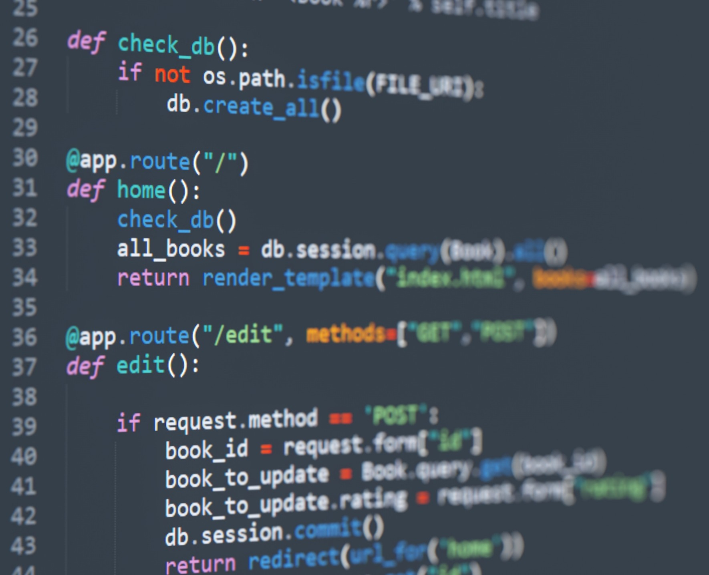

People say that humans are a product of their environment and frankly, I would have to agree. From a young age, I've been constantly surrounded by technology. Computers became part of my daily routine and gave me an unbelievable number of memorable experiences, both to my benefit, and possible detriment. I like to believe that my early exposure to technology was a massive factor in my development throughout my childhood, and as you would expect, spending so much time around something everyday made me grow more and more curious. How does this little box under my desk do all of this? How do my games work? Is it magic? Well, no, it's not magic, which I quickly learned as I began investigating. During these days, my dad had been taking note of my interest in computers. As a guy working in IT himself, he would always try to teach me about how to manage my computer properly. Granted, he would mostly teach me after I had accidentally installed malware onto my computer while trying to install mods for Minecraft, but that's besides the point. Around this time, at about 10-12 years old, my dad would introduce me to a platform that would affect my future: Codecademy. 

## My introduction to programming
The first course I took to completion on Codecademy was one on JavaScript. It was a language recommended for beginners but, I felt accomplished, like I was a real coder now. Well, not quite. I haven't exactly *made* anything yet. I wasn't sure what you could do with just Javascript, and so I looked around and learned about the magic duo, HTML and CSS. With these three, I could make web applications! And so, as you would expect, I looked at the HTML and CSS course on Codecademy. I'm not exactly a great designer and so I looked at some example code for the two and thought, yeah, no, I'm good, and shelved the idea. Instead, I decided that I wanted to make desktop games. However, I stepped away from coding for a while until I discovered Unity and C# in high school. I fell in love with C# and grew comfortable with it over time. Although I haven't made any major projects with these two tools just yet, I had the ability to make it happen. However, here is where my true problems show.

## My aspirations for the future
I have a major issue with deciding on a project idea. Finding something that I *want* to make has been incredibly difficult. Either it's too large of a scale and I end up being demotivated, or it's too small to consider it a long-term project or interesting enough to continue. Personally, I do not plan on making my career focused on programming and software development, and instead in cybersecurity. However, my goal in this class is to brainstorm ideas for passion projects and to learn project management skills to take into other software ventures or creating cybersecurity tools. I lack structure in my development process and would really like some guidance in planning a long-term project whether it be as a team or an individual side project. And although I somewhat dread the idea of a group assignment as our final, I am looking forward to experiencing the troubles of creating a web application in a team scenario. 

Getting comfortable using command-line is also something that would be greatly beneficial, not just as a software engineer, but as a cybersecurity specialist. Being able to navigate and manipulate files using just command-line is something I've simply never gotten around to learning in a sufficient capacity. I'm not sure how much use we will get out of a terminal in this class, but anything will be welcome. As for more technical aspirations, I really want to get comfortable with solving "coding interview" questions. Not exactly for an interview, but for the ability to quickly address coding problems with effective solutions and algorithms. The type of structured thinking that comes with software engineering is something I wish to continue developing in the future for all aspects of my life, as it meshes well with how I normally think. 

## In other words..
I have had a relatively short life so far. However, there is no denying that technology has been a dominating aspect of my life. My love for computers has slowly grown over the years and has accumulated to make me what I am today: a somewhat lost software engineer unsure of where to go next. With that being said, my journey has brought me to my third year in a bachelor program for computer science. I have some high hopes for ICS 314. Hopes that it will provide me with some context in how to use the skills I have had an interest in for years, but had no location to focus them. Hopes that I will be able to work toward something tangible for myself in this field. Will that come to be? Who knows. The semester has just begun.