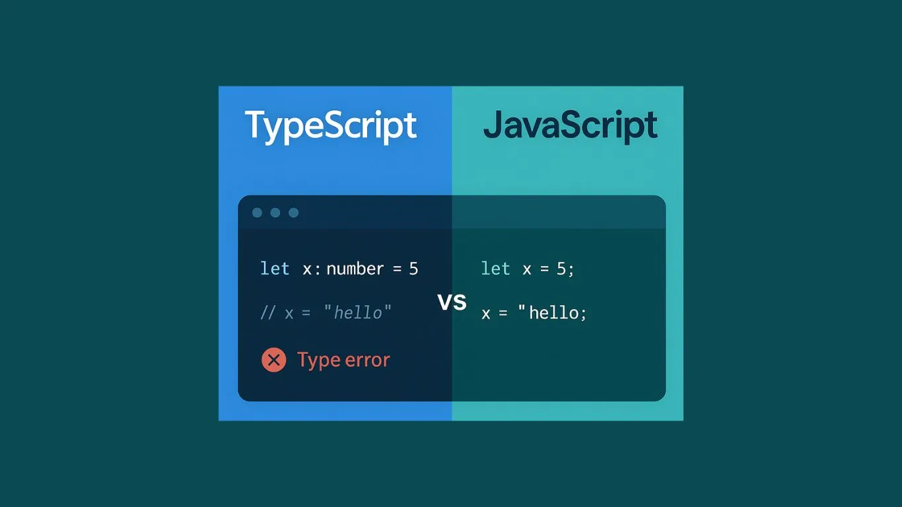

My experience with TypeScript isn't *exactly* new, but I am very much a beginner with it. That being said, I have always loved using TypeScript as opposed to pure JavaScript simply due to one feature. *Static typing*. Being able to declare and read static types is an absolute game changer, especially when you're concerned about incorrect inputs. It's also amazing when trying to debug a problem that normally isn't flagged by JavaScript's compiler. Oh, your function output looks strange? Well, with TypeScript you might find out that you accidentally returned a boolean when the function needed a number (to be fair, in some languages booleans *are* a number) and so you know that something is wrong before you even try to run it! The convenience that TypeScript has over JavaScript is refreshing. It's very similar to other static typed languages like C#, Java, and C++, yet still has a lot of the type flexibility that comes with JavaScript.

## Possible issues
Generally, I view TypeScript as a great language. However, I think that's if you are intentionally writing TypeScript code as *TypeScript*. It being a superset language of JavaScript, most JavaScript code could run in a TypeScript file by default, and if it doesn't, it can be refactored to work the exact same with no real changes to the typing. This can cause issues that is characteristic when using JavaScript instead of TypeScript, like reading an undefined value because you used *any* for every variable type. If you're writing TypeScript within the framework of TypeScript, it was made to solve these types of problems. It's a lot more efficient when managing values. Another issue that may surface with TypeScript: compile times. Now, I don't have much experience using TypeScript. However, my understanding is that takes all the code at compile time and effectively translates it *back* into JavaScript. I'm sure this isn't a crazy difficult task for a modern computer to handle, but my assumption is that creates a lot of overhead for the compiler to work through, increasing compile time. In small-scaled projects I'm sure that factor is abysmally small, but in larger scale projects, I'm sure that adds extra hiccups in the work flow after making edits. 

## My thoughts on WODs (Workout of the Day)
Athletic software engineering is a new subject to me. I'm not exactly sure about what that term means, but WODs on the other hand, are like the bread and butter of interview prep. To me, the idea of WODs are almost a carbon copy of doing LeetCode or Codewars questions. You're given a problem, you're given some parameters, and your job is to write a function to solve it. I think these types of assignments are very helpful for coding in general. That's because, it's just that. Coding. The philosophy that practice makes perfect applies here. Having these as part of a curriculum is great because it's not only practice, its *curated* practice. Although mindless coding can be good practice, having a source that can identify bad practices in code and provide insight is invaluable as it is really easy to feel lost or overcomplicate a problem. 

Personally, I enjoy the idea of WODs. The fear of reaching a DNF is definitely strong, especially with so many points on the line, but it is still an enjoyable period where you get to practice the programming thought process in mini programs. I may just be biased. I enjoy coding, however, I would compare WODs to something like those "writing practice" assignments you would be given by your high school teacher to research, outline, and write an essay in 40 minutes. Depending on the problem and your comfortability, this can feel like a massive crunch and be detrimental to your success. Especially when you have a massive chunk of your grade relying on you passing these. There's a simple answer though. Practice on your own. Easy to say it, but that practice needs material. Doing the same WOD over and over isn't enough for most. Having more practice WODs to force you to think about other algorithms is necessary to push people to success (if they do them).